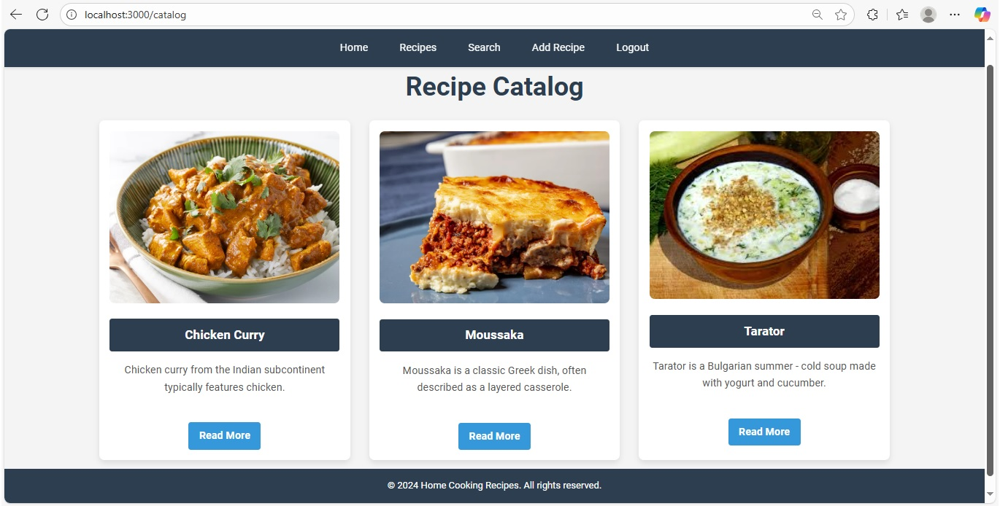
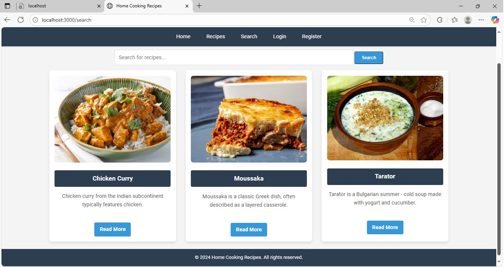
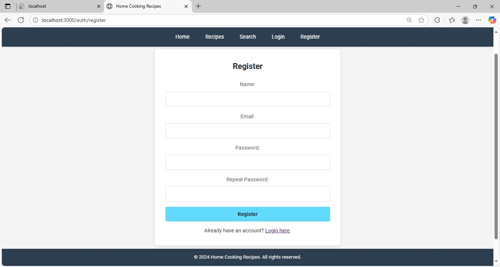

# Home Cooking Recipes 🍲

A server-side rendered web application for sharing and exploring home-cooked recipes.
 
Build with **Node.js**, **Express**, **MongoDB** и **Handlebars**.

---

## 📸 Screenshots

---

## 🚀 Getting Started

### 🧩 1. Clone the repository
git clone https://github.com/dimitar86kostov/Portfolio.git

### 📂 2. Navigate to the project folder
`cd home-cooking-recipes`

### 📦 3. Install dependencies
`npm install`

### ▶️ 4. Start the application
`npm start`

### 🌐 5. Open in your browser
http://localhost:3000

✨ Features

👤 User registration and login

➕ Add new recipes

✏️ Edit and delete recipes

📜 View a list of all recipes

🛠 Technologies Used

Node.js – backend runtime environment

Express.js – web application framework

MongoDB – database

Handlebars – templating engine

CSS – styling

📂 Project Structure

home-cooking-recipes/
│
├── models/         # Database models
├── views/          # Handlebars templates
├── public/         # Static assets (CSS, images)
├── controllers/    # Route controllers
├── routes/         # Application routes
├── package.json
└── index.js        # Application entry point
