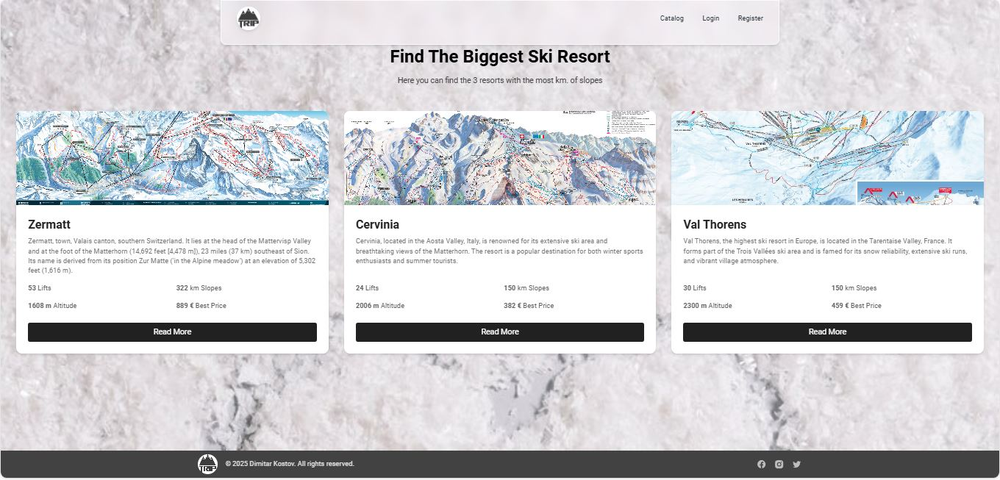
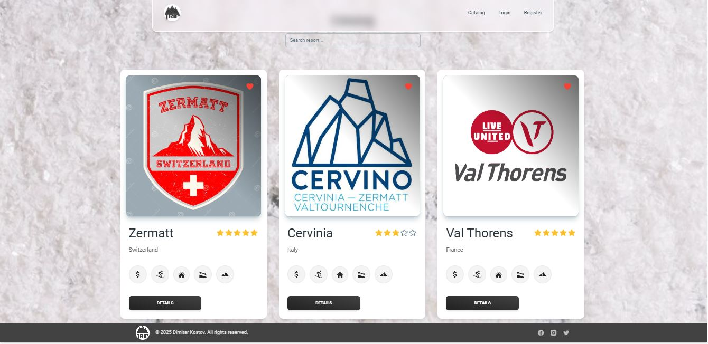
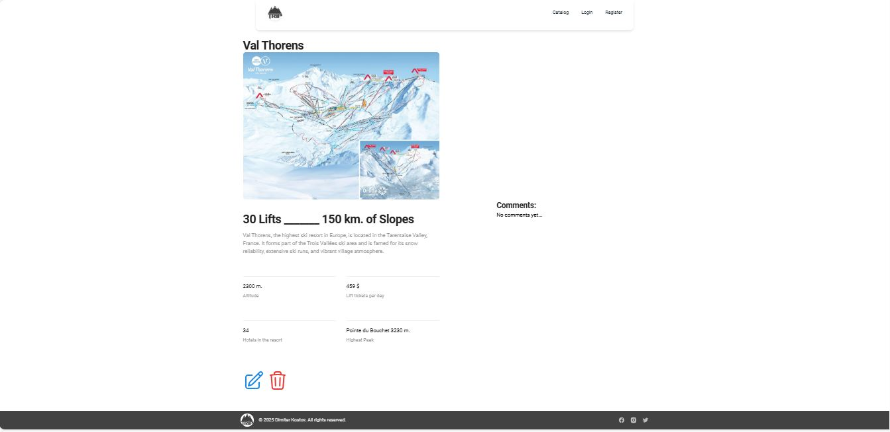
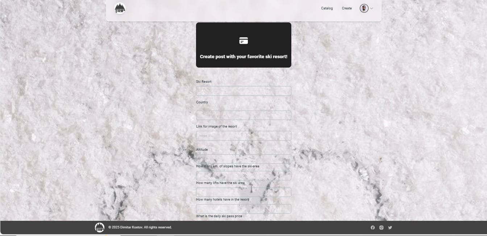
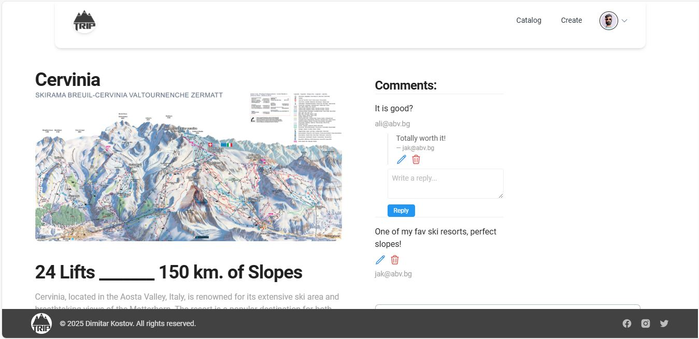

# Ski Resorts Platform

## Project Description

Built as a modern Single Page Application (SPA) with **React** and client-side routing, this front-end web app allows users to seamlessly share their ski resort experiences—with fast navigation and no full-page reloads. Users can perform full **CRUD operations** on their own posts, leave comments on others' posts, and reply to any comment. The responsive UI is styled using **Tailwind CSS** and **CSS Modules**, with state and data flow managed via a service-layer abstraction.

## Features

* 🔍 **Searching includes all ski resorts the planet:** Full info about each ski resort, including the number of kilometers of ski slopes, altitude, number of lifts, highest peak, number of hotels in the resort, and more.

* ➕ **Creating new ski resorts if missing from on the platform:** Users can add new ski resorts with detailed information and upload a ski map.

* 💬 **Commenting:** Users can share their own experiences by leaving comments on each ski resort, also reply to other users' comments.

* 📦 **Pre-loaded data:** The platform comes with pre-loaded ski resort data to ensure a smooth user experience from the start.


## Technology Stack

- **Language:** HTML, JavaScript
- **Libraries and Frameworks:**
  -  React
  -  Vite
  -  TailwindCSS 

## 📸 Screenshots

### 🏔️ Home Page  


### 🎿 Catalog


### 🗺️ Resort Detail View  


### ➕ Add New Resort Form  


### 💬 Comments and Replies  


## 🚀 Getting Started

1. Clone the repository
```bash
git clone https://github.com/dimitar86kostov/Portfolio.git
cd Portfolio/wonder-trip-project
```

3. Install dependencies
```bash
npm install
```

4. Run the app in development mode
```bash
npm run dev
```

## 📂 Project Structure

```plaintext
wonder-trip-project/
│
├── client/               # Frontend client folder
│   ├── public/           # Static public assets (images, stylesheets)
│   │   └── styles/       # Global styles (CSS, Tailwind config and etc.)
│   ├── src/              # Source code
│   │   ├── api/          # API calls and service layer
│   │   ├── common/       # Route guards, shared utilities for routing
│   │   ├── components/   # Reusable React components
│   │   ├── contexts/     # React context providers
│   │   ├── hooks/        # Custom React hooks
│   │   ├── utils/        # Helper functions and utilities
│   │   ├── App.jsx       # Main application component
│   │   ├── Layouts.jsx   # Layout components (e.g., header/footer wrappers)
│   │   ├── index.jsx     # React DOM render entry point
│   │   └── main.jsx      # App bootstrap - main logic initialization
├── package.json          # Project dependencies and scripts
├── vite.config.js        # Vite configuration
└── README.md             # Project documentation
